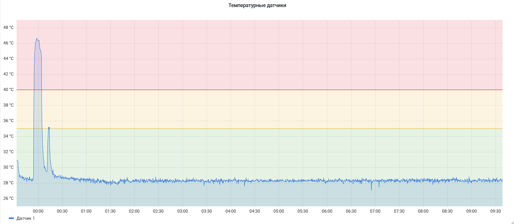

## Мониторинг температурных датчиков с поддержкой оповещений в Telegram

### Оборудование
- Iskra JS
- Термометр TMP36G
#### Подключение
© [Amperka Wiki](http://wiki.amperka.ru/yodo)


### Конфигурация

Создайте Telegram-бота (напишите `@botfather`), напишите ему и получите `Chat ID`.

Скопируйте шаблон конфигурации `alertmanager`:
```
cp alertmanager/config.yml.example alertmanager/config.yml
```
Затем откройте `alertmanager/config.yml` и введите туда свои `API key` и `Chat ID`.

Запустите сервер:
```
docker-compose up --build
```

Откройте `http://<адрес сервера>:3000/` в своём браузере и импортируйте `grafana-dashboard.json`.